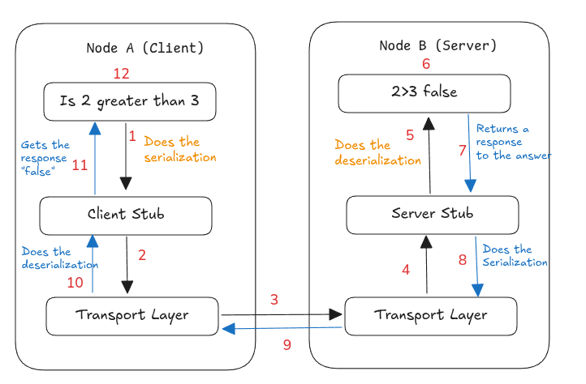
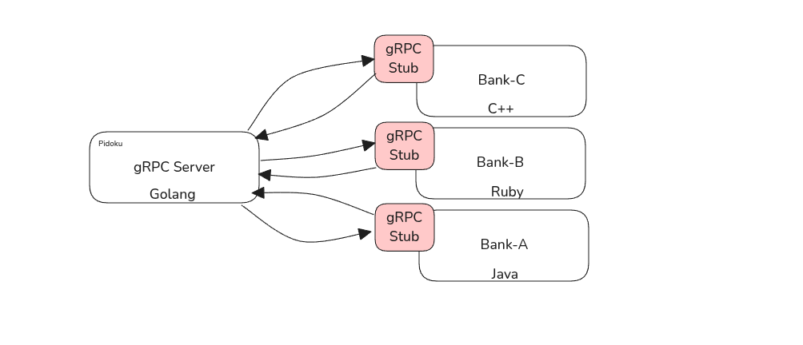

Taking HTTP/2 to next Level
> **Before understanding gRPC lets see what is RPC** 

## What is RPC(remote procedure call)? 

RPC is a communication protocol which allows a program to execute functions on a remote server as if it was a local function. RPC simplifies distributed computing by hiding network complexity. 

Consider you have a program calling a function, but here this function execution is on a remote server. The program which is calling this function does needs to know anything about the network details. 

### RPC components 

- **Client**:  It will initiates the RPC call 
- **Server**: This will receive the RPC call request and process/execute the function on it's server
- **Stub**:     A stub is a proxy that acts intermediary between a client and a server in RPC. It allows the client to call the remote function as if it was a local one. We have 2 stubs in RPC 
	- Client Stub: Represents the remote function on client side 
	- Server Stub: Receives the request on Server and invokes the function 
- **Marshalling/Serialization**: Process of converting data into suitable format to be consumed by both ends 
- **Deserialization/Unmarshalling**: Convert the formatted data back to it's original format.  

Below is an overview of RPC 


There are different ways we can use RPC

1. Synchronous: The client waits untill server responds 
2. Asynchronous: The client continue to send RPC request but doesn't wait for a response 
3. One-Way RPC: The client sends one request and doesn't wait for execution.


## Overview of gRPC 

It is an open-source [CNCF](https://cncf.io/) incubation project. It is a RPC framework developed by google on top of HTTP/2. gRPC uses protocol buffer as both its interface definition language and as its underlying message interchange format. Protocol buffer is more efficient then JSON. Check this [blog](https://www.atlassian.com/blog/atlassian-engineering/using-protobuf-to-make-jira-cloud-faster) where Atlassian used probuf to speed up JIRA. Lets' see more about protocol buffer and how it can change the way gRPC handles communication between 1000s of microservices. 

### Protocol buffer (Protobuf)

Protobuf is used for data serialization. It is language agnostic. It makes communication more compact fast and efficient making it ideal for distributed systems.

### How Protobuf works

1. Define the Data structure in `.proto` file 
```protobuf
syntax = "proto3"; // Use Proto version 3

message Person {
  string name  = 1;
  int32  age   = 2;
  string email = 3;
}
```

> `Person` here is similar to struct in golang. We will see how we can use golang to use `Person` struct


2. Compile the `.proto` file 

```protobuf
protoc --go_out=. person.proto
```


3. Use this struct in our program 

```go
package main

import (
	"fmt"
	"log"

	"google.golang.org/protobuf/proto"
)

// Generated Protobuf struct
type Person struct {
	Name  string
	Age   int32
	Email string
}

func main() {
	// Create a Person object
	person := &Person{
		Name:  "om",
		Age:   25,
		Email: "om@example.com",
	}

	// Serialize (convert to Protobuf format)
	data, err := proto.Marshal(person)
	if err != nil {
		log.Fatal("Error encoding:", err)
	}

	fmt.Println("Serialized Data:", data) // This is a compressed binary format

	// Deserialize (convert back to original format)
	newPerson := &Person{}
	err = proto.Unmarshal(data, newPerson)
	if err != nil {
		log.Fatal("Error decoding:", err)
	}

	fmt.Println("Decoded Person:", newPerson)
}

```


## Introduction to gRPC

Lets take an example. 
	Consider I have a organization providing credit score of a user to the bank. Let name the organization `pidoku` . Pidoku here will implement a gRPC server for banks which will fetch all the required information. Below are some advantage of doing this 
	1. **Low Latency**: gRPC make the credit look up fast compare to traditional REST 
	2. **High Performance:** When fetching data for thousands of users, Protocol Buffers (Protobuf) serialization and deserialization are significantly faster compared to JSON. JSON requires more computation, especially at scale, leading to higher processing costs. Protobuf's efficiency reduces compute overhead, minimizes unnecessary scaling, and optimizes resource usage. This advantage is particularly beneficial in large-scale systems.



> Here our gRPC server is implemented in Golang and different banks are using different languages for getting credit score. 

- **gRPC Server (Golang)**:
    
    - The **core service** is implemented in **Go**. It hosts the gRPC API and processes incoming client requests.
    - It handles operations like fetching, calculating, and delivering data (credit score).
    - Uses **Protocol Buffers (Protobuf)** as the interface definition language for defining services and message structures.
- **gRPC Stubs**:
    
    - The gRPC **stubs** are auto-generated client libraries (based on Protobuf definitions).
    - Each stub acts as a local proxy for the gRPC server, allowing clients to invoke remote methods as if they were local.
    - These stubs abstract the complexities of communication, serialization, and deserialization.

---

### Service Definition 
gRPC is based on idea of defining service which enable client to call a methods remotely on our server. Below is an example for our credit score system 


```protobuf 
syntax = "proto3";

service CreditScoreService {
  rpc GetCreditScore (CreditRequest) returns (CreditResponse);
}

message CreditRequest {
  string pan_number = 1; // Unique ID for Indian customers
}

message CreditResponse {
  int32 score = 1;       // Credit Score (e.g., 750)
  string risk_level = 2; // "Low", "Medium", "High"
}

```

Below are 4 types of service in gRPC 

#### Unary RPC

The client sends a single request to the server and the server sends back a single response. 

```protobuf
service CreditService {
    rpc GetCreditScore(CreditRequest) returns (CreditResponse);
}

message CreditRequest {
    string customer_id = 1;
}

message CreditResponse {
    int32 credit_score = 1;
}
```

#### Server Streaming RPC 

The client sends a single request to the server and server streams multiple response back to client 

```protobuf
service CreditService {
    rpc GetCreditScore(CreditRequest) returns (CreditResponse);
}

message CreditRequest {
    string customer_id = 1;
}

message CreditResponse {
    int32 credit_score = 1;
}
```

#### Client Streaming RPC 

The client sends a stream of requests to the server and the server responds with a single response once it processes of the requests 

```protobuf
service CreditService {
    rpc CalculateRisk(stream CreditRiskRequest) returns (CreditRiskResponse);
}

message CreditRiskRequest {
    string customer_id = 1;
}

message CreditRiskResponse {
    float risk_score = 1;
}
```


#### Bidirectional streaming RPC 

Both the client and the server can send a stream of messages to each other. The stream operate independently, meaning they can read and write in parallel 

```protobuf
service CreditService {
    rpc LiveCreditCheck(stream CreditRequest) returns (stream CreditResponse);
}
```
---

